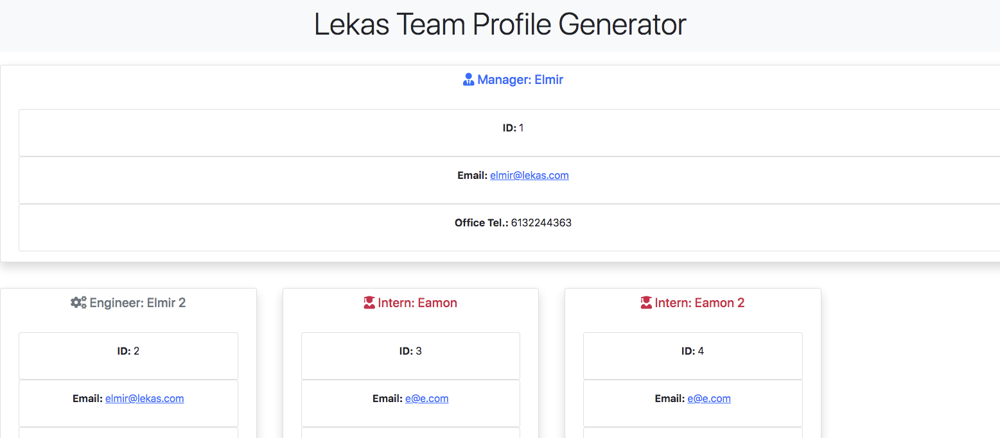

# lekas-team-profile-generator
Simple tool to build a team members lists

Use this team profile generator app to simply build an HTML page with team members of your team.

Steps:
1) node index.js:
- You are prompted with prompts to setup the manager
- You are than prompted with options to add intern on engineer
- After making a selection you are asked information about the profile
- After completing the profile questions you are prompted with profile type options
- or choose to exit and generate the html

The following image demonstrates the web application's appearance:

To view the demo of this app go to:
https://youtu.be/PEYCpa3aPww

